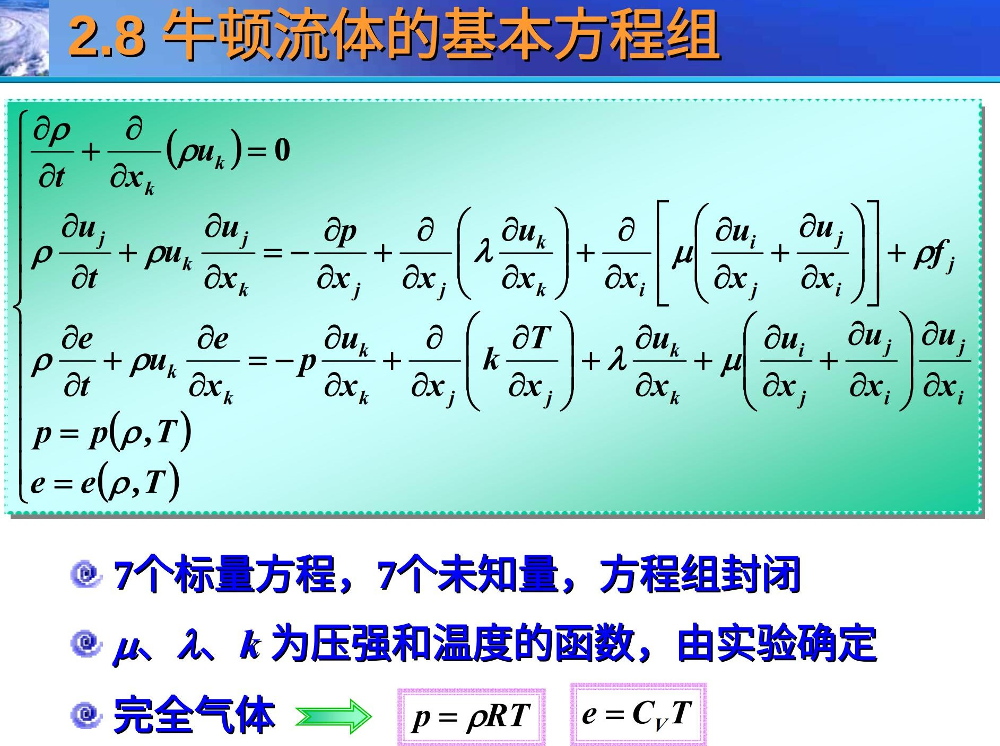
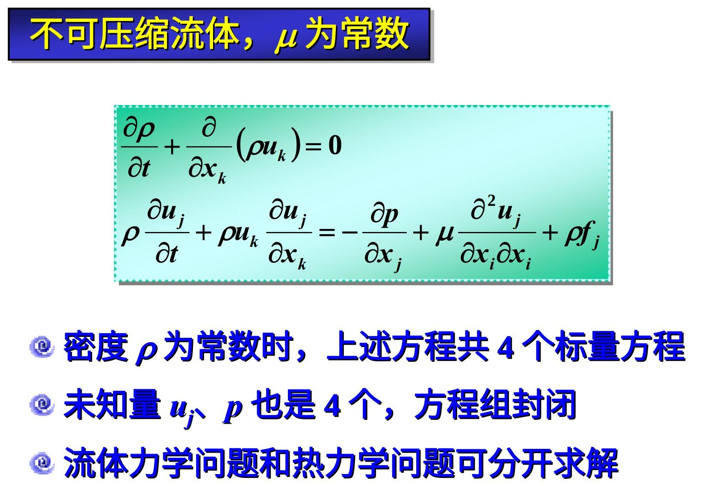
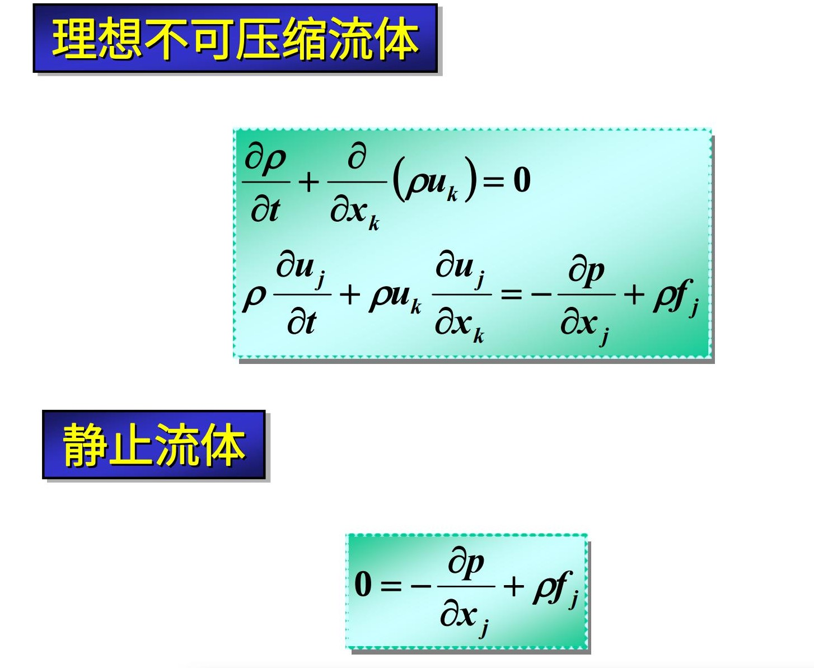

$$
\int_{\text{面}}\vec{f}\cdot{d}\vec{S}=\int_{\text{体}}\nabla\cdot\vec{f}dV\\
"\int_{\text{面}}{\text{标量}d\vec{S}}=\int_{\text{体}}\nabla\text{标量d}V"\\
\oint_{\text{egde}}\vec{f}\cdot d\vec{l}=\iint_{\text{surface}}(\nabla\times\vec{f})\cdot dS
\
$$

$$
\nabla\cdot(\rho\vec{V})=\rho\nabla\cdot\vec{V}+\vec{V}\cdot\nabla\rho
$$

---

> 质量守恒（内部质量&表面通量）

$$
\begin{aligned}
&\frac{\partial}{\partial{t}}\int_{\text{体}}\rho{dV}+\int_{\text{面}}\rho\vec{V}\cdot{d}\vec{S} = 0\\
\implies
&\frac{\partial\rho}{\partial{t}}+\nabla\cdot(\rho\vec{V})=0,\quad\text{单位控制体内质量变化率与流出控制体的通量}\\
\implies
&\frac{D\rho}{Dt}+\rho\nabla\cdot\vec{V}=0,\quad\text{“质点微团”体内质量变化与该微团表面通量}\\
\end{aligned}
$$

定常流动：$\frac{\partial{\rho}}{\partial{t}}=0\implies\nabla\cdot(\rho\vec{V})=0$

不可压缩流体 $(\text{Ma}\lt{0.3})$：$\rho=\text{const}\implies\frac{D\rho}{Dt}=0\implies\nabla\cdot\vec{V}=0$, 单位控制体通量为零

一维定常流动：$\rho{uA}=\text{const}$

密度分层流动

> 动量守恒

$$
\begin{aligned}
\frac{D}{Dt}\int_\Omega{f}dV
&=\int_\Omega[\frac{\partial{f}}{\partial{t}}+\nabla\cdot(f\vec{v})]dV\\
&=\int_\Omega\frac{\partial{f}}{\partial{t}}dV+\int_{\partial\Omega}f\vec{v}\cdot d\vec{S}
\end{aligned}
$$

$$
\int_{\text{体}}\frac{\partial{\rho\vec{V}}}{\partial{t}}dV+\int_{\text{面}}(\rho\vec{V})\vec{V}\cdot{d\vec{S}}
=\frac{D}{Dt}\int_{\text{体}}\rho\vec{V}dV=\int_{\text{体}}\rho\vec{f}dV+\int_{\text{面}}\vec{\tau}dS
$$

$\int_{\text{体}}\frac{\partial{\rho\vec{V}}}{\partial{t}}dV$ ：控制体中动量变化率

$\int_{\text{面}}(\rho\vec{V})\vec{V}\cdot{d\vec{S}}$ ：流出控制体的动量

$\frac{D}{Dt}\int_{\text{体}}\rho\vec{V}dV=\int_{\text{体}}\rho\vec{f}dV+\int_{\text{面}}\vec{\tau}dS$ ： 控制体上的外力之和

> 能量方程

$$
\frac{D}{Dt}\int_{\text{体}}\rho(e+\frac{1}{2}\vec{V}\cdot\vec{V})dV=\int_{\text{体}}\rho\vec{V}\cdot\vec{f}dV+\int_{\text{面}}\vec{V}\cdot\vec{\tau}dS-\int_{\text{面}}\vec{q}\cdot{d\vec{S}}
$$

$$
\text{左式}=\frac{\partial}{\partial t}\int_{\text{体}}\rho(e+\frac{1}{2}\vec{V}\cdot\vec{V})dV+\int_{\text{面}}\rho(e+\frac{1}{2}\vec{V}\cdot\vec{V})\vec{V}\cdot{d\vec{S}}\\
=\int_{\text{体}}\rho\vec{V}\cdot\vec{f}dV+\int_{\text{面}}\vec{V}\cdot\vec{\tau}dS-\int_{\text{面}}\vec{q}\cdot{d\vec{S}}
$$

q：热流密度

内能+动能=体积力做功+表面张力做功+热辐射

---

方程：质量守恒+动量守恒+能量守恒+气体压强+能量=1+3+1+1+1=7

未知数：$\vec{V}, \rho, e, p, \vec{f}$ 

实验测定：$\lambda, \nu, k$

$$
\partial_t U + \nabla\cdot f(U)=0, \quad  x\in\Omega\subset\mathbb{R},t\in(0,T] \\

U = \begin{bmatrix}
\rho \\
\rho u
\end{bmatrix}

\quad

f(U) = \begin{pmatrix}
\rho u\\
\rho u^2 +p 
\end{pmatrix}
$$
