sNS equation ,ignore the viscosity, Elur equation, bo 

N-S equation 牛顿流体的运动规律
$$
\frac{\partial\vec{V}}{\partial{t}}+(\vec{V}\cdot\nabla)\vec{V}
=\frac{\mathrm{D}\vec{V}}{\mathrm{D}t}
=\vec{f}-\frac{1}{\rho}\nabla{p}+\frac{\mu}{\rho}\nabla^2\vec{V}+\frac{\mu}{\rho}\nabla(\nabla\cdot\vec{V})
$$
Euler equation 无黏流体 $\text{Re}\gg1$
$$
\frac{\mathrm{D}\vec{V}}{\mathrm{D}t}=\vec{f}-\frac{1}{\rho}\nabla{p}
$$
粘性力只在边界层（雷诺数很小的地方叫做边界层）起作用，雷诺数（$\text{Re}=\frac{\rho v L}{\mu}$）很（可以认为粘性力很小），边界层很薄
$$
\tau=\mu\frac{\partial{u}}{\partial{y}}
$$
雷诺数并不是不变的，描述这个流动用$\text{Re}_L\gg\text{Re}_\delta$ 描述薄层流动

绕柱流动，边界层后面会有很大的  **分离区** 

边界层模拟，网格对边界层计算准确性影响巨大，无粘处网格大，边界层处网格密。

对于湍流，网格还需要考虑所用湍流模型。

分离指：主流与壁面分离，分离之前他们之间是薄薄的边界层，分离后两者之间产生低速回流区。

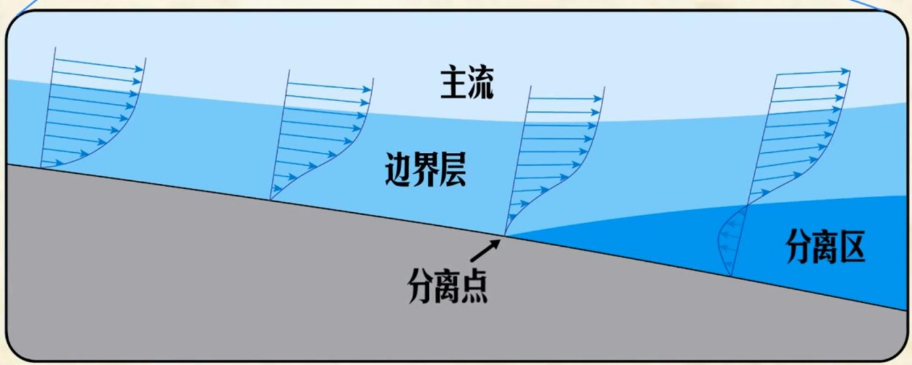

湍流比层流抗分离能力要强很多：湍流很强的非定常性，流体大尺度的在上下层进行动量交换，相互拖动

一定范围内，攻角增大，升力增加。超过一定阈值，气流分离，升力减小，压差阻力变大。

层流，摩擦阻力小，产生分离。机翼前半部层流，后半部湍流

流体的机械能不可逆的转化为内能称为流动损失。分离带来流动损失。

 层流：有规律的流动。湍流：高雷诺数下的不规则流动现象（大涡-》小涡-》耗散）

层流涡，湍流涡

雷诺平均：瞬时速度=平均速度+脉动速度（$u=\bar{u}+u'\,,u'_{max}\lt \bar{u}$）

均匀各向同性湍流理论。耗散尺度（不能再小了）

宏观尺度-》积分尺度-》泰勒尺度-》耗散尺度（-》分子自由程）

流体粘性系数越大，流动则会在越大的尺度上发生耗散。粘性系数越小的流体，涡会破碎成更小的涡，在极小的尺度上耗散。
$$
\text{雷诺数、湍动能、耗散率}\\
\text{Re}_L=\frac{u_0l_0}{\nu} \quad k\sim{u_0^2} \quad \varepsilon\sim{\frac{u_0^3}{l_0}} \\
\text{Re}_L=\frac{k^3}{\varepsilon\nu}
$$
层流中，动能直接通过剪切变形耗散成内能。

湍动能中，动能先转化成湍动能，再逐步破碎成小涡，在小涡中耗散。

在剪切层中，分子上下层之间的跳动产生的切应力是流体粘性力。流体微团上下跳动产生的切应力是涡粘性力。

---

马赫数、雷诺数、湍流度、尺寸

---

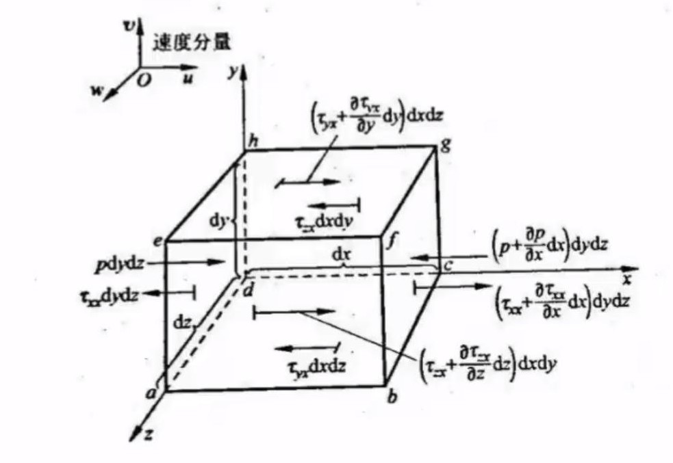

$$
F_x=[-\frac{\partial{p_x}}{\partial{x}}+\frac{\partial{\tau_{xx}}}{\partial{x}}+\frac{\partial{\tau_{yx}}}{\partial{y}}+\frac{\partial{\tau_{zx}}}{\partial{z}}+\rho{f_x}]dxdydz
$$
注意有 $\frac{Du}{Dt}=\frac{\partial{u}}{\partial{t}}+\vec{V}\cdot\nabla{u}$

非守恒型
$$
\rho\frac{Du}{Dt}=-\frac{\partial{p_x}}{\partial{x}}+\frac{\partial{\tau_{xx}}}{\partial{x}}+\frac{\partial{\tau_{yx}}}{\partial{y}}+\frac{\partial{\tau_{zx}}}{\partial{z}}+\rho{f_x} \\
\rho\frac{Dv}{Dt}=-\frac{\partial{p_y}}{\partial{y}}+\frac{\partial{\tau_{xy}}}{\partial{x}}+\frac{\partial{\tau_{yy}}}{\partial{y}}+\frac{\partial{\tau_{zy}}}{\partial{z}}+\rho{f_y} \\
\rho\frac{Dw}{Dt}=-\frac{\partial{p_z}}{\partial{z}}+\frac{\partial{\tau_{xz}}}{\partial{x}}+\frac{\partial{\tau_{yz}}}{\partial{y}}+\frac{\partial{\tau_{zz}}}{\partial{z}}+\rho{f_z}
$$
质量守恒
$$
\frac{\partial{\rho}}{\partial{t}}+\nabla\cdot(\rho\vec{V})=0
$$

$$
\text{Re}=\frac{\rho{vL}}{\mu}
$$

- *[ρ](https://en.wikipedia.org/wiki/Rho_(letter))* is the [density](https://en.wikipedia.org/wiki/Density) of the fluid ([SI units](https://en.wikipedia.org/wiki/SI_units): kg/m3)
- *v* is a characteristic velocity of the fluid with respect to the object (m/s)
- *L* is a characteristic linear dimension (m)
- *[μ](https://en.wikipedia.org/wiki/Mu_(letter))* is the [dynamic viscosity](https://en.wikipedia.org/wiki/Dynamic_viscosity) of the [fluid](https://en.wikipedia.org/wiki/Fluid) (Pa·s or N·s/m2 or kg/(m·s))

随体导数！！

激波厚度，几个分子自由程的厚度

激波：能感知下游物体运动的上游物体的最远点。

---

# 计算流体动力学CFD基础学习分享

拉格朗日和欧拉描述之间的关系：流体质点(*a*,*b*,*c*)在*t*时刻恰好运动到空间点(*x*,*y*,*z*)上

拉格朗日更多的可以写为：$f_{a,b,c}(t)$, 欧拉写为：$F(x,y,z,t)$

$\frac{DF(x,y,z,t)}{Dt}=(\vec{v}\cdot\nabla)F+\frac{\partial{F}}{\partial{t}}$, 为欧拉表述下的随体导数。$\frac{\partial f}{\partial t}$ 为拉格朗日下的随体导数

所以有，迹线、流线

Re=$\frac{\rho u L}{\mu}, \mu$ is the vicsity。

连续性方程（质量守恒）
$$
\frac{\partial}{\partial t}\iiint_\Omega \rho dxdydz+\iint_{\partial\Omega}{\rho\vec{v}\cdot d\vec{S}}=0 \\
\frac{\partial\rho}{\partial t}+\nabla\cdot(\rho\vec{v})=0
$$
NS方程（动量守恒）
$$
\rho\frac{Du}{Dt}=-\frac{\partial{p_x}}{\partial{x}}+\frac{\partial{\tau_{xx}}}{\partial{x}}+\frac{\partial{\tau_{yx}}}{\partial{y}}+\frac{\partial{\tau_{zx}}}{\partial{z}}+\rho{f_x} \\
\rho\frac{Dv}{Dt}=-\frac{\partial{p_y}}{\partial{y}}+\frac{\partial{\tau_{xy}}}{\partial{x}}+\frac{\partial{\tau_{yy}}}{\partial{y}}+\frac{\partial{\tau_{zy}}}{\partial{z}}+\rho{f_y} \\
\rho\frac{Dw}{Dt}=-\frac{\partial{p_z}}{\partial{z}}+\frac{\partial{\tau_{xz}}}{\partial{x}}+\frac{\partial{\tau_{yz}}}{\partial{y}}+\frac{\partial{\tau_{zz}}}{\partial{z}}+\rho{f_z}
$$

- 可压缩粘性流体的动量守恒方程

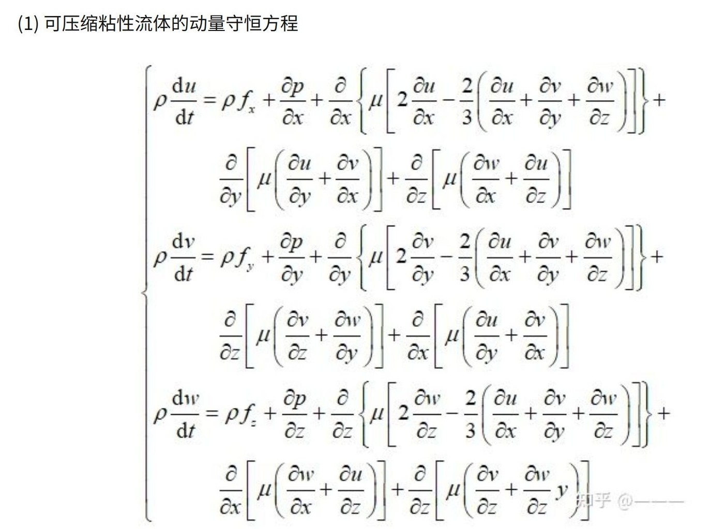

- 常粘性流体 $\rho\frac{d\vec{v}}{dt}=\rho\vec{f}-\nabla{p}+\frac{\mu}{3}\nabla(\nabla\cdot\vec{v})+\mu\nabla^2\vec{v}$
- 常密度常粘性流体 $\rho\frac{d\vec{v}}{dt}=\rho\vec{f}-\nabla{p}+\mu\nabla^2\vec{v}$, （$\rho=\text{const}, \nabla\cdot\vec{v}=0$）
- 无粘性流体(常密度，欧拉方程) $\rho\frac{d\vec{v}}{dt}=\rho\vec{f}-\nabla{p}$, （$\mu=0$）
- 静力学方程 $0=\rho\vec{f}-\nabla{p}$, （$\vec{v}=0$）

能量方程

热传导(辐射)+热通量(对流)+粘性耗散

---

https://zhuanlan.zhihu.com/p/334967122

爱因斯坦记号
$$
\frac{\partial\bar{\rho}}{\partial t}+\frac{\partial}{\partial x_i}(\bar \rho \bar u_i+\overline{\rho'u_i'}) = 0\\
\rho\frac{D\bar u_j}{Dt}=-\frac{\partial \bar p}{\partial x_j}+\frac{\partial}{\partial x_i}(\mu\frac{\partial \bar u_j}{\partial x_i}-\rho\overline{u_i'u_j'})+\overline{\rho_j}, \quad \forall j
$$
$\overline{\rho'u_i'}$ 湍流附加项，$\rho\overline{u_i'u_j'}$ 流体应力，记为雷诺应力($\tau_{i,j}$) ,三个正应力，三个切应力。此处六个力未知，因为这是湍流对平均流动的影响。

时均能量方程，平均动能方程

湍动能方程 turbulence kenitic energy，k方程$k=\frac{1}{2}\overline{u_i'u_i'}$

涡量方程：涡存在流速场中，流速分布不均使涡束发生变形及转向，随着涡束的拉伸变形，大尺度漩涡在时均流场吸收能量，并向小尺度漩涡逐级传递，最后在小尺度的漩涡运动中通过粘性将能量由机械能转变为热能耗散，这就是湍流的发展过程及本质。

湍流正真的问题是尺度处理。

最小尺度（耗散尺度，**Kolmogorov尺度** $\eta=(\nu^3/\varepsilon)^{1/4}$）

- 耗散率 $\varepsilon$ ：每次耗散的能量，决定了涡流的大小
- 分子粘度 $\nu$ ：耗散的首要原因

最大尺度

- 通过湍动能产生率 $\text{P}_k$, 从生长周期中提取能量，大部分湍动能存储在大尺度涡中。
- 所有产生的湍流都会消散，平均而言 $\text{P}_k=\varepsilon$

湍流长度尺度
$$
L_t=\frac{k^{3/2}}{\varepsilon}
$$
RANS

三个动量方程，质量守恒方程，三个速度分量，压力。多出来留个雷诺应力

模型的封闭（**Boussinesq 假设**）

引入湍流粘度（涡粘度）$\mu_t$ 来对应力 $\tau_{ij}$ 建模，给出了速度与雷诺应力显示的关系，表示湍流特性

！一些模型

- 雷诺应力模型RSM
- 尺度解析仿真（Scale-Resolving Simulation, SRS）模型
- 直接数值模拟（DNS）$\frac{L_t}{\eta} \sim (\frac{\sqrt{k}L_t}{\nu})^{3/4} \sim Re_t^{3/4}$, 随着雷诺数的增加，计算成本极高
- 大涡模拟（LES），解析大尺度涡流，对小尺度涡流建模

湍流时间尺度
$$
\frac{T_t}{\tau}\sim(\frac{\sqrt{k}L_t}{\nu})^{1/2}
$$
对一计算雷诺应力：$k-\varepsilon$ 模型，$k-\omega$ 模型（都包含k方程）

壁面无量纲变量
$$
U^+=\frac{U}{u_\tau} \qquad y^+=\frac{\Delta yu_\tau}{\nu} \qquad u_\tau=\sqrt{\frac{\tau_\omega}{\rho}}
$$
$\tau_\omega$ ：壁面切应力、$y$ 离壁距离、$\nu$ 动力粘度、$u_\tau$ 摩擦速度、$U+$ 无量纲近壁面速度、$y+$ 无量纲的与壁面距离

近壁流动不受外侧流的影响，仅受壁面剪切力、粘性和壁面距离的影响。因此可以假设可以在壁面附近获得统一的速度分布行为，与是否存在平板明渠流、雷诺数等无关。

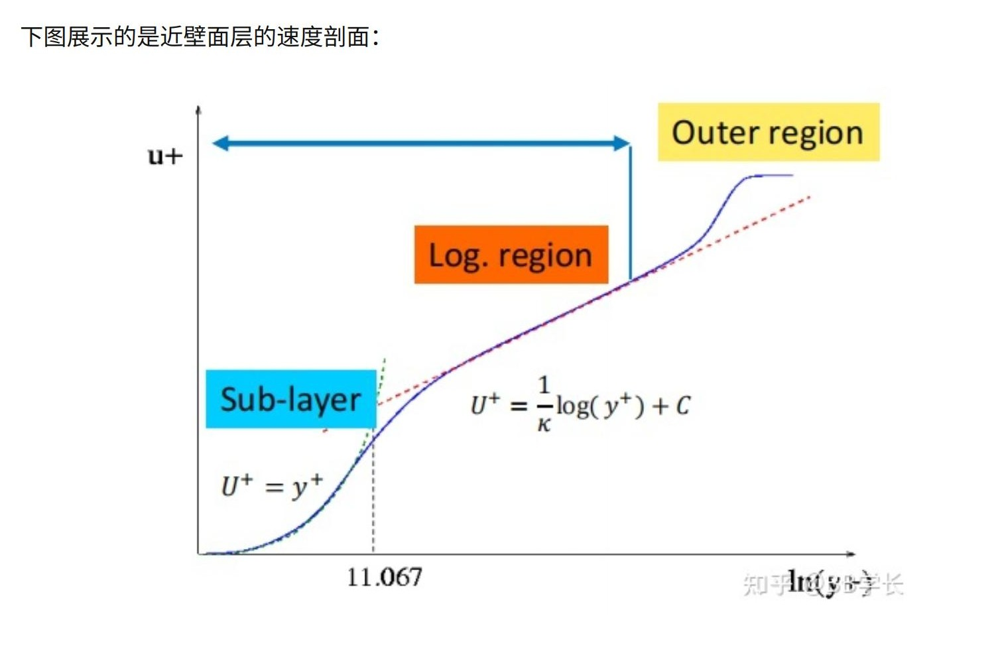

https://www.zhihu.com/column/c_1312743915977043968

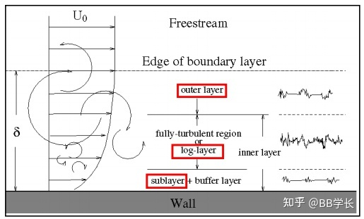

$\text{Re}_t=\frac{k^2\nu}{\varepsilon}$ 湍流雷诺数

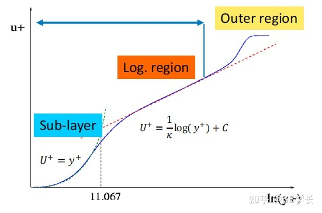

边界层内需要足够数量的网格来求解$U,k,\varepsilon/\omega$

LES

- 网格数量随着雷诺数增大而增加

conservation laws of mass
$$
\frac{\partial \rho}{\partial t}+\nabla\cdot\vec{v}=0
$$
consevation laws of momentum

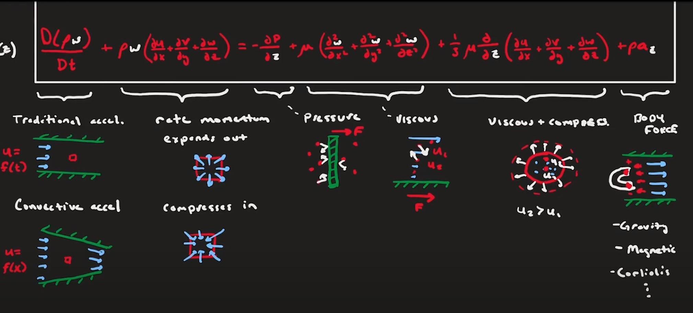
$$
\frac{D(\rho\vec{v})}{Dt}+\rho\vec{v}\nabla\cdot\vec{v}=\rho\vec{f}-\nabla{p}+\frac{\mu}{3}\nabla(\nabla\cdot\vec{v})+\mu\nabla^2\vec{v}
$$
assumptions: 

- no body forces, $\rho \vec{f}=0$
- inviscid, $\mu=0$
- steady, $\frac{\partial(\cdot)}{\partial t} = 0$

$$
\vec{v}\cdot\nabla(\rho\vec{v})+\rho\vec{v}\nabla\cdot\vec{v}=-\nabla{p} \\
\implies
\nabla\cdot(\rho u \vec{v})=-\frac{\partial p}{\partial x}
$$

$$
u\frac{\partial(\rho u)}{\partial x}+v\frac{\partial(\rho u)}{\partial y}+w\frac{\partial(\rho u)}{\partial z}+\rho u(\frac{\partial u}{\partial x}+\frac{\partial v}{\partial y}+\frac{\partial w}{\partial z})=-\frac{\partial p}{\partial x} \\
u\frac{\partial(\rho v)}{\partial x}+v\frac{\partial(\rho v)}{\partial y}+w\frac{\partial(\rho v)}{\partial z}+\rho v(\frac{\partial u}{\partial x}+\frac{\partial v}{\partial y}+\frac{\partial w}{\partial z})=-\frac{\partial p}{\partial y} \\
u\frac{\partial(\rho w)}{\partial x}+v\frac{\partial(\rho w)}{\partial y}+w\frac{\partial(\rho w)}{\partial z}+\rho w(\frac{\partial u}{\partial x}+\frac{\partial v}{\partial y}+\frac{\partial w}{\partial z})=-\frac{\partial p}{\partial z}
$$

+ incompressible

$$
\vec{v}\cdot\nabla(\rho\vec{v})=-\nabla{p}
$$

`Bernoulli Eqn` (one dimension)
$$
u\frac{\partial \rho u}{\partial x}+\frac{\partial p}{\partial x}=0\\
\implies
\rho\int{u\frac{\partial u}{\partial x}}ds+\int\frac{\partial p}{\partial x}dx=0\\
\implies
P+\frac{1}{2}\rho u^2=\text{const}
$$

能量守恒

热+功=能量
$$
\delta q_{\text{heat}}+\delta w_{\text{work}} = \delta e_{\text{enegy}}
$$

$$
\begin{aligned}
& \frac{D}{Dt}[\rho(e+\frac{\vec{v}^2}{2})]+\rho(e+\frac{\vec{v}^2}{2})(\frac{\partial u}{\partial x}+\frac{\partial v}{\partial y}+\frac{\partial w}{\partial z}) 
\\
&=\rho\dot{q}-(\frac{\partial(p u)}{\partial x}+\frac{\partial(pv)}{\partial y}+\frac{\partial(pw)}{\partial z})
+\rho(f_xu+f_yv+f_zw)+\dot{Q}_{visc.}+\dot{W}_{visc.} \\
&\implies
\frac{D(\rho E)}{Dt}+\rho E \nabla\cdot\vec{v}=\rho\dot{q}-\nabla\cdot(p\vec{v})+\rho\vec{f}\cdot\vec{v}+\dot{Q}_{visc.}+\dot{W}_{visc.}, \quad E=e+\frac{\vec{v}^2}{2}
\end{aligned}
$$

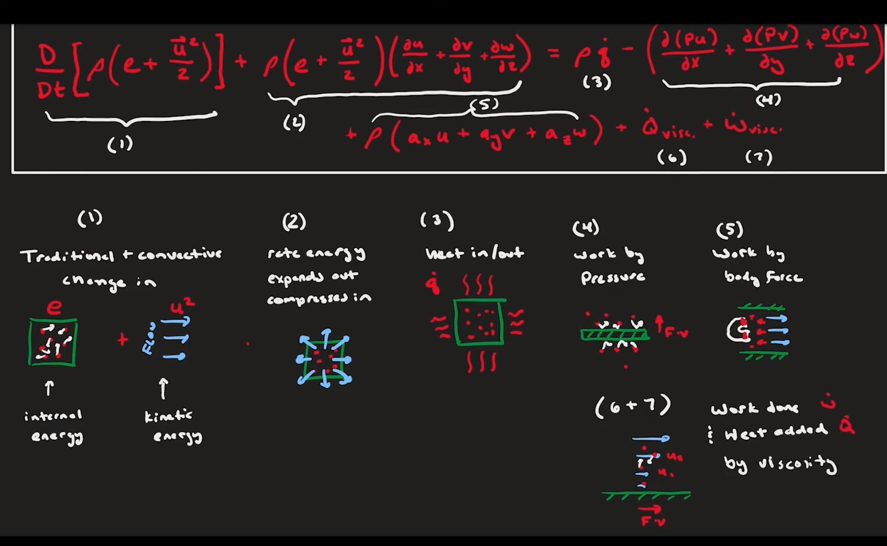

assumption

- steady, $\frac{\partial(\cdot)}{\partial t} = 0$
- inviscid, $\mu=0$
- adiabatic(绝热的), $\dot{q}=0$
- no body forces, $\vec{f}=0$

$$
u\frac{\partial}{\partial x}[\rho(e+\frac{\vec{v}^2}{2})]+v\frac{\partial}{\partial x}[\rho(e+\frac{\vec{v}^2}{2})]+w\frac{\partial}{\partial x}[\rho(e+\frac{\vec{v}^2}{2})]
=
-(\frac{\partial(p u)}{\partial x}+\frac{\partial(p u)}{\partial y}+\frac{\partial(p u)}{\partial z})\\
\implies
\vec{v}\cdot\nabla[\rho(e+\frac{\vec{v}^2}{2})]=-\nabla(p\vec{v})\\
\text{additional Eqn for solving }\quad  "e"\\
e=C_vT, P=\rho R T
$$

velocity, pressure, density, energy, temperature

conservation laws (3) + state Eqn + perfect gas Eqn

---

path lines(for particle), streak lines(more particles), streamlines

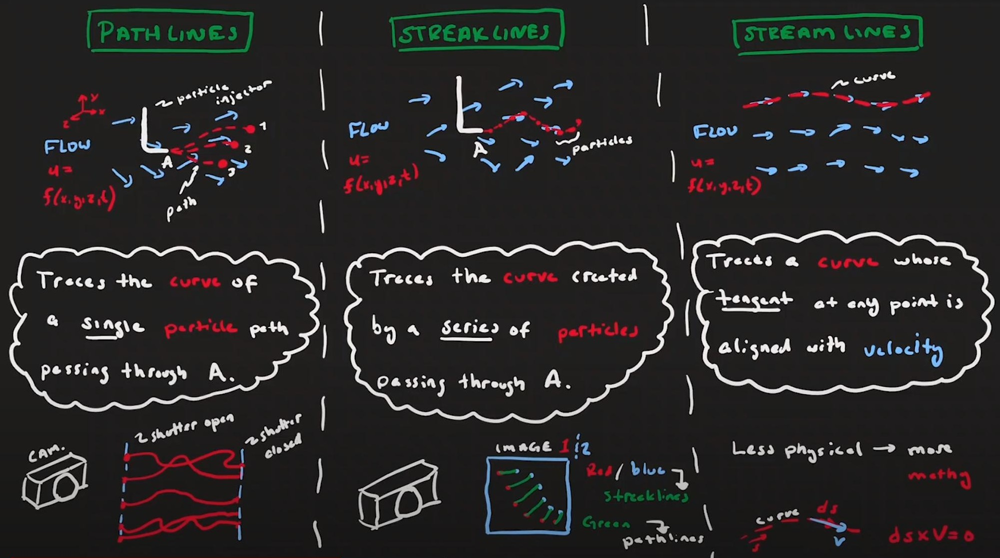

steady: three things is the same thing
$$
\vec{\omega}=\frac{1}{2}[(\frac{\partial w}{\partial y}-\frac{\partial v}{\partial z})i+(\frac{\partial u}{\partial z}-\frac{\partial w}{\partial x})j+(\frac{\partial v}{\partial x}-\frac{\partial u}{\partial y})k]\\
\implies
\vec{\omega}=\nabla\times\vec{v}=\text{curl }\vec{v}
\begin{bmatrix}
i&j&k\\
\frac{\partial}{\partial x}&\frac{\partial}{\partial y}&\frac{\partial}{\partial z}\\
u&v&w
\end{bmatrix}
$$

$$
\iint _{\Sigma }(\nabla \times \mathbf {F} )\cdot \mathrm {d} ^{2}\mathbf {\Sigma } =\oint _{\partial \Sigma }\mathbf {F} \cdot \mathrm {d} \mathbf {\Gamma } \\
\oint_{\text{egde}}\vec{f}\cdot d\vec{l}=\iint_{\text{surface}}(\nabla\times\vec{f})\cdot d\vec{S}
$$

conservation laws of mass, momentum, energy is governing equations

bulk modulus 体积弹性率

低温低密度使得声速降低

for compressible fluid (more specified, aerodynamics)
$$
\begin{aligned}
&\text{Mass}\\
&\qquad \nabla\cdot(\rho\vec{v})+\frac{\partial\rho}{\partial t}=0\\
&\text{Momentum }(\times 3)\\
&\qquad u\frac{\partial(\rho u)}{\partial x}+v\frac{\partial(\rho u)}{\partial y}+w\frac{\partial(\rho u)}{\partial z}+\rho u(\frac{\partial u}{\partial x}+\frac{\partial v}{\partial y}+\frac{\partial w}{\partial z})=-\frac{\partial p}{\partial x}\\
&\text{Energy}\\
&\qquad \vec{v}\cdot\nabla{E}=-\nabla\cdot(p\vec{v}), \text{where } E=\rho(e+\frac{\vec{v}^2}{2})\\
&\text{Thermo Dynamic}\\
&\qquad P=\rho RT\\
&\qquad e=C_vT \\
&\qquad \text{perfect gas: ignore intermoleculer force}\\
&\qquad \text{reversible: no friction or irreverible enegy transfer}\\
&\qquad \text{adiabatic: no heat transfer}\\
&\qquad \text{Isentropic uncnenged entropy=reversible+adiabatic}\\
\end{aligned}
$$
stagnation condition: some quantities will be the const  !

通过shock wave后，$Ma, u$ 降低, $\rho, T, P$ 增加，kinetic energy -> internal energy

hypersonic = fluid + thermo + chemistry

---

ML in Fluid Mechanism

NS Eqn for incompresible fluid
$$
\frac{\partial u}{\partial t}+(u\cdot\nabla)u=-\nabla p+\frac{1}{\text{Re}}\nabla^2u\\
\nabla\cdot u=0
$$
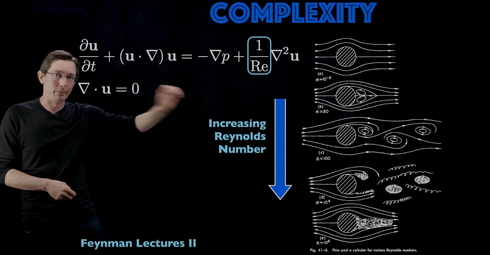

closure model : 模拟出大涡，计算小涡的平均以及小涡对大涡的影响。

$\text{Re}=\frac{\rho UD}{\mu}$
$$
\begin{aligned}
&\text{Reynolds Decomposition}&\\
&& u(x,t)=\overline{U}(x)+u'(x,t)\\
&\text{Mean Flow}&\\
&& \overline{U}(x)=\lim_{T\to\infty}\int_0^Tu(x,t)dt\\
&\text{Tuebulent Fluctuations}&\\
&& u'(x,t)=u(x,t)-\overline{U}(x)
\end{aligned}
$$

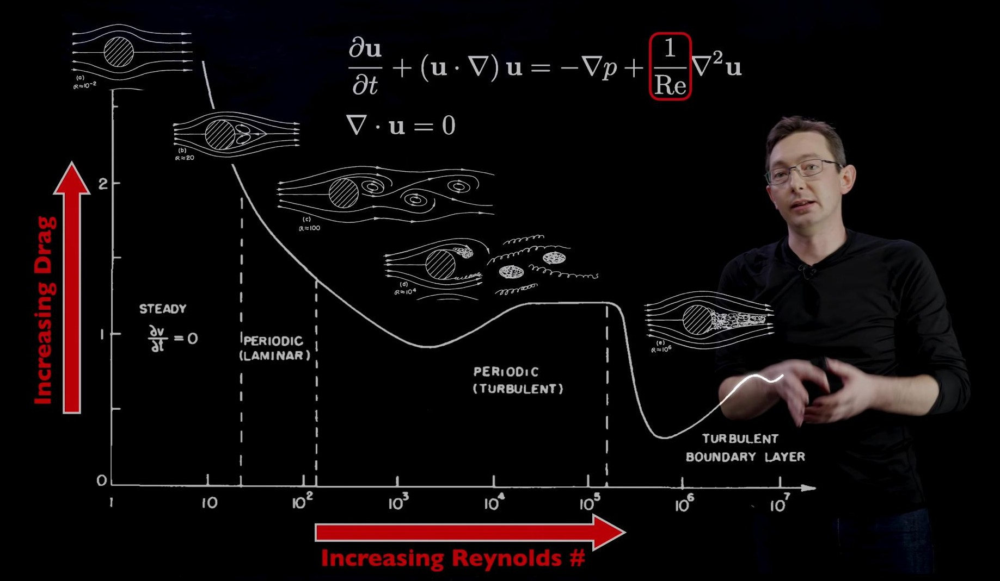

Reynolds Averaged Navier Stokes(RANS)
$$
\begin{aligned}
&\text{x-component of momentum equation:}\\

&\qquad\qquad \overline{U}\frac{\partial\overline{U}}{\partial x}+\overline{V}\frac{\partial\overline{U}}{\partial y}+\overline{W}\frac{\partial\overline{U}}{\partial z}+\frac{\partial\overline{u'u'}}{\partial x}+\frac{\partial\overline{u'v'}}{\partial y}+\frac{\partial\overline{u'w'}}{\partial z}=-\nabla\overline{p_x}+\frac{1}{\text{Re}}\nabla^2\overline{U}\\

\checkmark&\qquad\qquad\bar{U}\bar{U_x}+\bar{V}\bar{U_y}+\bar{W}\bar{U_z}+u'u'_x+v'u'_y+w'u'_z=-\nabla\overline{p_x}+\frac{1}{\text{Re}}\nabla^2\overline{U}\\

&\text{And }\\
&\qquad\qquad 1.\quad \overline{u'u'_x}=\frac{\partial\overline{u'u'}}{\partial x}-\overline{u'u'_x}, \qquad \frac{\partial\overline{u'u'}}{\partial x}=\overline{\frac{\partial u'^2}{\partial x}}=\overline{2u'\frac{\partial u'}{\partial x}}\\
&\qquad\qquad 2.\quad \overline{v'u'_y}=\frac{\partial\overline{u'v'}}{\partial y}-\overline{u'v'_y}\\
&\qquad\qquad 3. \quad \overline{w'u'_z}=\frac{\partial\overline{u'w'}}{\partial z}-\overline{u'w'_z}\\
&\text{Add three terms up, note that }\quad u'(\nabla\cdot\vec{v'})=0. \quad \text{Because }\quad \nabla\cdot\vec{\overline{v}}=\nabla\cdot\vec{v'}=0\\
&\qquad\qquad \frac{\partial\overline{u'u'}}{\partial x}+\frac{\partial\overline{u'v'}}{\partial y}+\frac{\partial\overline{u'w'}}{\partial z}=u'u'_x+v'u'_y+w'u'_z
\end{aligned}
$$

$$
\frac{\partial\bar{\rho}}{\partial t}+\frac{\partial}{\partial x_i}(\bar \rho \bar u_i+\overline{\rho'u_i'}) = 0\\
\rho\frac{D\bar u_j}{Dt}=-\frac{\partial \bar p}{\partial x_j}+\frac{\partial}{\partial x_i}(\mu\frac{\partial \bar u_j}{\partial x_i}-\rho\overline{u_i'u_j'})+\overline{\rho_j}, \quad \forall j
$$

low-pass filter Navier-Stokes equation onto coarse grid

closure problem: Nonlinearity couples scales, so need sub-grid-scale(SGS) models

POD (the Proper Orthogonal Decomposition)

https://www.youtube.com/watch?v=axfUYYNd-4Y

最大似然估计是样本的函数（fit the distribution to the data）

概率：给定概率分布看实例在哪个区间，p(data|distribution_fix)

似然：参数对现有数据的拟合程度，p(distribution|data_fix)

---

Reynolds Stresses (these terms creats stress on our mean flow model)
$$
\begin{aligned}
&\text{x-component}\\
&\qquad\qquad\frac{\partial\overline{u'u'}}{\partial x}+\frac{\partial\overline{u'v'}}{\partial y}+\frac{\partial\overline{u'w'}}{\partial z}
\end{aligned}
$$
Closure Prioblem: Mean flow profile depends on turbulrnt fluctions!

approximate these mean flow quantities

find a model for these Reynolds Stresses

爱因斯坦记号 (pressure, viscous diffusion Renolds stresses)
$$
\overline{U}_j\frac{\partial \overline{U}_i}{\partial x_j}=\frac{1}{\rho}\frac{\partial}{\partial x_j}(-p\delta_{ij}+2\mu\overline{S}_{ij}-\rho\overline{u'_iu'_j}), \forall i\\
\overline{S}_{ij}=\frac{1}{2}(\frac{\partial \overline{U}_i}{\partial x_j}+\frac{\partial \overline{U}_j}{\partial x_i})
$$
to clarify the relationship between the mean flow and the turbulent fluctuations

Turnulent Kinetic Energy
$$
k=\frac{1}{2}(\overline{u'u'}+\overline{v'v'}+\overline{w'w'})
$$

---

$$
\qquad\qquad \overline{U}\frac{\partial\overline{U}}{\partial x}+\overline{V}\frac{\partial\overline{U}}{\partial y}+\overline{W}\frac{\partial\overline{U}}{\partial z}+\frac{\partial\overline{u'u'}}{\partial x}+\frac{\partial\overline{u'v'}}{\partial y}+\frac{\partial\overline{u'w'}}{\partial z}=-\nabla\overline{p_x}+\frac{1}{\text{Re}}\nabla^2\overline{U}
$$
Eddy Viscosity Models (Boussinesq 1877)
$$
-\overline{u'v'}=\nu_t(\frac{\partial \overline{U}}{\partial y}+\frac{\partial \overline{V}}{\partial x})\\
-\overline{u'_iu'_j}=\nu_t(\frac{\partial \overline{U_i}}{\partial x_j}+\frac{\partial \overline{U_j}}{\partial x_i})-\frac{2}{3}k\delta_{ij}
$$

1. Simplest Models: $\nu_t$ is a constant
2. Prandtl: $\nu_t$ is a function of distance from wall. $\nu_t=|\frac{\partial \overline{U}}{\partial y}|\mathcal{l}^2_m, \quad l_m$ is the mixing length

$k-\varepsilon$ model: Two additional PDEs. $\nu_t=\rho C_\mu\frac{k^2}{\varepsilon}$

$k$ : Turbulent kinetic energy (TKE)

$\varepsilon$ : Rate of dissipation of TKE

not for adverse pressure gradients or reverse flow (accompany with vortex shedding or seperation buble)

then One equation model

LES

Closure Problem: Nonlinearity couple scales, so need sub-grid-scale(SGS) model

---

[Reynolds stress](https://en.wikipedia.org/wiki/Reynolds_stress)
$$
R_{ij}=\langle u_{i}^{\prime }u_{j}^{\prime }\rangle =-\tau _{ij}/\rho \\
=\frac{2}{3}k\delta_{ij}-2\nu_tS_{ij} \quad S_{ij}=(\partial_i \overline{u_j}+\partial_j\overline{u_i}),k=\frac{\overline{u'_iu'_i}}{2}
$$

---

Tensor

scalar: 1 component 0 basis

vector: 3 components (1 basis vector/component)

vector向量（一阶张量）：$\vec{a}=19\vec{i}+12\vec{j}+0.5\vec{k}$, three components and one basis vector for each component

9 components (2 basis vector/component)

cross-section横截面
